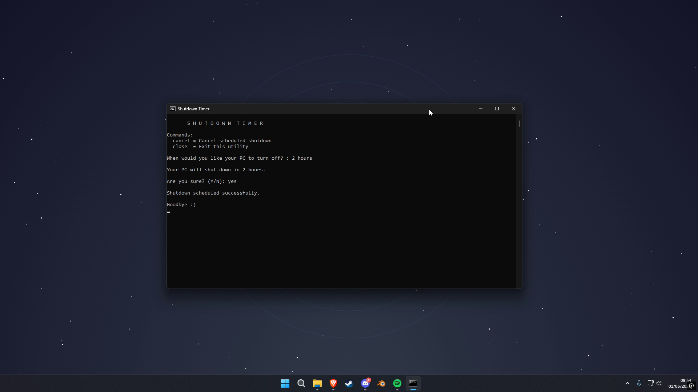

# Shutdown Timer

A lightweight Windows utility for scheduling automatic shutdowns.

## Screenshot



## Features

* Schedule shutdowns using seconds, minutes, hours, or days
* Supports multiple input formats
* Confirmation prompt before scheduling
* Cancel active shutdown timers
* Lightweight and portable
* No installation required

## Examples

```text
30s
45m
3h
2d

10 minutes
2 hours
1 day
```

## Supported Formats

### Seconds

```text
1s
1sec
1secs
1second
1seconds
```

### Minutes

```text
1m
1min
1mins
1minute
1minutes
```

### Hours

```text
1h
1hr
1hrs
1hour
1hours
```

### Days

```text
1d
1day
1days
```

## Commands

```text
cancel
close
```

## Running

If scheduling or cancelling a shutdown does not work, run the application as Administrator:

1. Right-click the application.
2. Select **Run as administrator**.

## Download

Download the latest version from the **Releases** section of this repository.

## License

This project is licensed under the MIT License.
